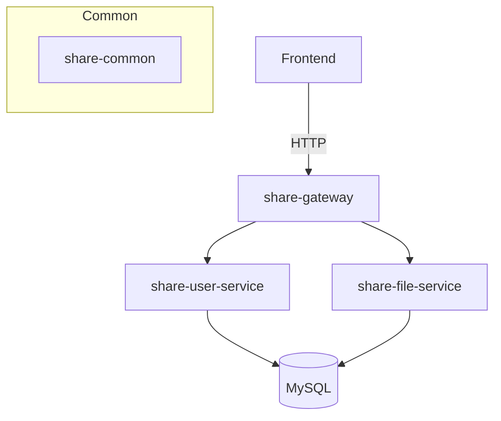
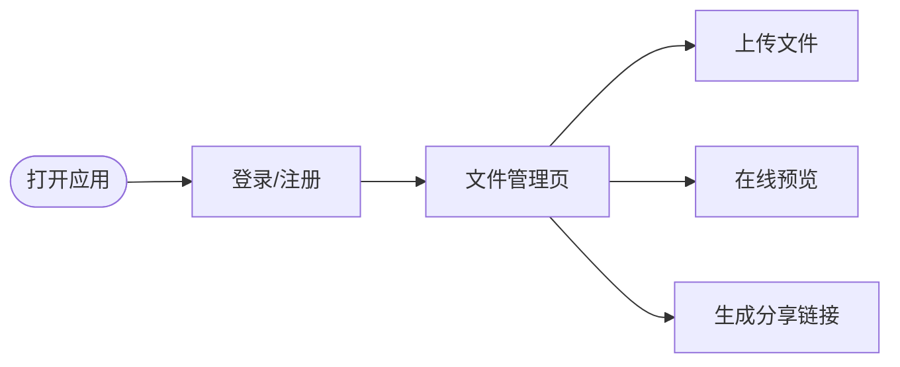

# ShareSystem — 个人学习资料分享系统

[](https://maven.apache.org/)
[](https://www.oracle.com/java/)
[](https://spring.io/projects/spring-boot)

一个基于 Spring Cloud 微服务架构的轻量级个人网盘系统，面向个人/教育场景，用于管理、预览与分享学习资料。

目录（快速跳转）
- [简介](#简介)
- [亮点与功能](#亮点与功能)
- [模块与架构](#模块与架构)
- [快速开始](#快速开始)
- [开发与运行](#开发与运行)
- [界面（UI）示意](#界面ui示意)
- [项目结构](#项目结构)
- [贡献指南](#贡献指南)
- [许可](#许可)

## 简介

ShareSystem 用于个人学习资料的上传、管理、在线预览与安全分享。项目采用微服务拆分：网关、用户服务、文件服务，以及公共依赖模块，方便替换与扩展。

本仓库为教学/个人部署示例，适合用于课程设计、个人备份或二次开发。

## 亮点与功能

- 微服务架构：`share-gateway`、`share-user-service`、`share-file-service`、`share-common`
- 安全认证：JWT 无状态鉴权
- 文件策略：分片上传、秒传（MD5）、断点续传、Range 下载
- 在线预览：图片/视频/音频/PDF/Office/文本预览
- 分享管理：分享链接 + 提取码 + 有效期设置
- 管理后台：用户/文件/分享监控与管理
- 前端风格：Apple 风格扁平化 UI，网格/列表视图切换

## 模块与架构

整体采用 Gateway + 多个微服务的典型架构：



- `share-gateway`：统一入口，负责 JWT 校验、路由、静态资源（前端）服务
- `share-user-service`：用户注册/登录、JWT 签发、用户信息管理（端口示例：8081）
- `share-file-service`：文件上传/下载、分片合并、预览、分享（端口示例：8082）
- `share-common`：公共 DTO、工具类（JWT/MD5/响应封装）

更多细节请参阅代码目录（下方项目结构）。

## 快速开始

先决条件：JDK 1.8、Maven、MySQL（或本地内存 DB 做演示）

1. 克隆仓库

```bash
git clone <your-repo-url>
cd ShareSystem
```

2. 修改数据库配置（在各服务的 `application.yml` 或 `application.properties` 中）

3. 编译并启动（示例：Maven 多模块）

```bash
mvn clean package -DskipTests
# 进入各服务 target 目录分别运行或用 IDE 启动模块
java -jar share-gateway/target/share-gateway-1.0.0.jar
java -jar share-user-service/target/share-user-service-1.0.0.jar
java -jar share-file-service/target/share-file-service-1.0.0.jar
```

4. 打开浏览器访问 `http://localhost:8080`（取决于 `share-gateway` 配置）

### 本地快速调试（单体运行）

如果不想运行 Nacos 等注册中心，可将服务配置改为直接访问本地服务或使用 `spring.profiles.active=local`（项目中如已提供）。

## 开发与运行

- 构建：`mvn clean package`
- 单服务启动：进入 `share-user-service`/`share-file-service`/`share-gateway` 模块，运行 `mvn spring-boot:run`
- 常见端口（示例，实际以 `application.yml` 为准）：
    - `share-gateway` -> 8080
    - `share-user-service` -> 8081
    - `share-file-service` -> 8082

### 常见命令

```bash
# 构建并跳过测试
mvn -T 1C -DskipTests clean package

# 运行单模块（示例）
cd share-gateway
mvn spring-boot:run
```

## 界面 UI 示意

下面为简要 UI 设计要点与示意图（用于设计与二次开发参考）。README 中的“占位”图片请在部署或截图后替换为真实截图。

- 风格：Apple 风格扁平化，主色 `#0071e3`，圆角卡片，细腻阴影
- 布局：顶部导航 + 左侧侧栏 + 主内容区（网格/列表切换）

示意流程图：



示意界面（建议替换为实际截图）:

- 登录页：毛玻璃卡片 + 社交登录按钮（QQ）
- 主文件页：顶部搜索、操作栏（新建/上传/分享）、文件网格
- 预览页：右侧信息栏显示文件属性、下载/分享按钮

> UI 原型/资源位置：前端静态文件夹位于 `share-gateway/src/main/resources/static`，页面文件参考 `webapp/pages`。请在部署后将真实截图替换 README 中占位图。

## 项目结构（高层）

```
ShareSystem/
├─ share-common/          # 公共模块
├─ share-user-service/    # 用户服务
├─ share-file-service/    # 文件服务
├─ share-gateway/         # API 网关 + 前端静态资源
├─ sql/                   # 初始化脚本
└─ README.md
```

本仓库内模块路径示例：
- [share-gateway](share-gateway)
- [share-user-service](share-user-service)
- [share-file-service](share-file-service)

## 配置与注意事项

- 请在 `application.yml` 中配置数据库、Nacos 地址与 JWT 秘钥
- 分片上传默认分片大小为 1MB，可在前端/后端同步配置
- 若部署到生产，请启用 HTTPS、调整 JWT 过期策略并审计文件访问权限

## 贡献指南

欢迎贡献代码、Issue 和 PR：

1. Fork 本仓库
2. 新建分支 `feat/xxx` 或 `fix/xxx`
3. 提交并发起 PR，描述变更和测试步骤

## 许可

本项目为教学示例，默认未附带商业许可。请在使用或发布前补充合适的 LICENSE 文件。

---

如果你希望我把 README 中的 UI 占位替换成真实截图、或者增加部署脚本（Docker Compose / Kubernetes 清单），告诉我想要的目标平台，我可以继续补全。 

---

## 一、引言

### 1. 课程设计背景

随着信息技术的飞速发展和互联网的普及，数字化学习资源呈现爆炸式增长。学生和教师在日常学习和科研工作中产生了大量的电子文档、教学视频、论文文献、课件资料等数字资产。传统的文件存储方式（如U盘拷贝、本地硬盘存储、邮件附件传输）存在存储容量有限、文件易丢失、分享不便、跨设备访问困难等诸多问题。

网盘技术作为云计算在个人存储领域的重要应用，以其海量存储、随时随地访问、便捷分享等特点，已成为数字时代不可或缺的基础设施。国外有Google Drive、Dropbox、OneDrive等产品，国内有百度网盘、阿里云盘等知名产品。然而，通用网盘产品存在广告过多、下载限速、隐私安全等问题，催生了自建网盘系统的需求。

近年来，微服务架构逐渐成为企业级应用的主流架构模式。Spring Cloud 作为 Java 生态中最成熟的微服务解决方案，通过将大型单体应用拆分为多个职责单一、独立部署的微服务，显著提升了系统的可维护性、可扩展性和开发效率。本课程设计旨在运用 Spring Cloud 微服务技术，构建一个面向个人学习资料管理的专用网盘系统。

### 2. 课程设计目的

（1）**掌握微服务架构设计**：通过 Spring Cloud 框架的实践，深入理解微服务架构的核心概念，包括服务注册与发现（Nacos）、API网关（Gateway）、服务间通信（OpenFeign）、负载均衡等关键组件的原理和应用。

（2）**提升全栈开发能力**：从数据库设计、后端微服务开发到前端界面实现，完成一个完整项目的全流程开发，锻炼前后端协同开发能力。

（3）**学习分布式系统关键技术**：在项目中实践 JWT 无状态认证、文件分片上传与合并、MD5 秒传、断点续传等分布式场景下的常用技术方案。

（4）**解决实际问题**：针对学生学习资料管理的实际需求，设计并实现一个集文件存储、管理、分享、预览于一体的综合性网盘平台，满足用户对数据安全和便捷访问的需求。

---

## 二、网盘项目概述

### 1. 网盘项目的概念与特点

**网盘**（Cloud Storage，云存储）是一种基于云计算技术的网络存储服务，它允许用户通过网络将文件上传到远程服务器，并在任何时间、任何有网络连接的设备上访问和管理这些文件。

本系统的主要特点：

| 特点 | 描述 |
|------|------|
| **微服务架构** | 采用 Spring Cloud 微服务架构，服务解耦，独立部署 |
| **高可用性** | Nacos 服务注册发现，支持多实例扩展 |
| **安全可靠** | JWT 无状态认证、MD5 密码加密、Token 过期机制 |
| **智能上传** | 支持秒传（MD5 去重）、分片上传、断点续传 |
| **在线预览** | 支持图片、视频、音频、PDF、Office 文档等格式预览 |
| **便捷分享** | 分享链接+提取码双重保护，支持有效期设置 |
| **用户友好** | Apple 简约风格 UI，网格/列表双视图，拖拽上传 |

### 2. 网盘项目的发展历程

网盘技术的发展大致经历了三个阶段：

**第一阶段（2005-2010）：萌芽期。**以 Dropbox（2007年创立）为代表的同步型网盘出现，实现文件的云端同步和多设备访问。

**第二阶段（2010-2018）：爆发期。**国内外网盘产品大量涌现，百度网盘、Google Drive、OneDrive、iCloud 等成为主流，存储容量从 GB 级扩展到 TB 级，并加入了在线预览、协同编辑等功能。

**第三阶段（2018至今）：成熟与分化期。**网盘技术从单纯的存储工具演进为生产力平台，融入了 AI 智能搜索、知识管理、团队协作等高级功能。同时，微服务架构、容器化部署等云原生技术使自建网盘系统更加灵活和强大。

本系统借鉴了成熟网盘产品的核心功能设计，采用 Spring Cloud 微服务架构实现了新一代的自建网盘方案。

### 3. 网盘项目的应用领域

（1）**教育领域**：师生教学资源共享、作业提交与批改、在线课件管理。

（2）**企业办公**：文档协同编辑、项目资料归档、团队知识库建设。

（3）**个人管理**：照片备份、学习笔记整理、个人知识体系构建。

（4）**科研协作**：实验数据共享、论文文献管理、科研项目协同。

本系统聚焦于**教育领域**，为个人学习资料管理提供专用解决方案。

---

## 三、课程设计内容

### 1. 需求分析

#### （1）功能需求

**用户模块：**
- 用户注册（用户名、密码、昵称、邮箱）
- 用户登录（密码登录、QQ OAuth 2.0 第三方登录）
- 个人信息管理（修改密码、修改昵称、上传头像）
- 存储空间查看

**文件模块：**
- 文件上传（普通上传、分片上传、秒传）
- 文件下载（支持 Range 断点续传）
- 文件在线预览（图片、视频、音频、PDF、文本、Office）
- 文件管理（新建目录、重命名、移动、删除）
- 回收站（还原文件、彻底删除、清空回收站）
- 文件搜索

**分享模块：**
- 创建分享链接（支持设置提取码和有效期）
- 通过分享码访问文件
- 分享下载统计
- 取消分享

**管理后台：**
- 用户管理（启停用户、分配存储空间）
- 文件管理（查看所有文件、删除文件）
- 分享管理（查看已分享文件、取消分享）

#### （2）用户需求

| 用户角色 | 核心需求 |
|----------|----------|
| **普通用户** | 注册登录、上传下载文件、文件预览、文件分享、回收站管理 |
| **管理员** | 管理所有用户、分配存储配额、管理所有文件、监控系统状态 |

#### （3）性能需求

| 指标 | 要求 |
|------|------|
| 单文件上传大小 | ≤ 200MB |
| 分片大小 | 1MB |
| 并发用户数 | ≥ 50 |
| 文件预览响应时间 | ≤ 3s |
| API响应时间 | ≤ 500ms |
| 系统可用性 | 99.5% |

### 2. 总体设计

#### （1）系统架构设计

```
┌─────────────────────────────────────────────────────────┐
│                    前端层 (Frontend)                      │
│        HTML5 + CSS3 + JavaScript (Apple 简约风格)          │
└─────────────────────┬───────────────────────────────────┘
                      │ HTTP/REST API
┌─────────────────────▼───────────────────────────────────┐
│               API 网关 (share-gateway:8080)               │
│         Spring Cloud Gateway + JWT 全局鉴权 + CORS         │
└────┬──────────────┬──────────────────┬──────────────────┘
     │              │                  │
┌────▼──────┐ ┌─────▼──────┐ ┌───────▼─────────┐
│  Nacos    │ │  User Svc  │ │   File Svc      │
│Registry   │ │  (8081)    │ │   (8082)        │
│Config     │ │            │ │                 │
│:8848      │ │ - 注册登录  │ │ - 文件管理      │
│           │ │ - QQ OAuth │ │ - 分片上传      │
│           │ │ - 用户管理  │ │ - 秒传/预览     │
│           │ │ - JWT签发  │ │ - 分享/下载     │
└───────────┘ └────────────┘ └─────────────────┘
                     │              │
              ┌──────▼──────────────▼──────┐
              │        MySQL 8.0           │
              │   share_system 数据库       │
              └────────────────────────────┘
```

**微服务拆分：**

| 服务名 | 端口 | 职责 |
|--------|------|------|
| share-gateway | 8080 | API网关、JWT鉴权、CORS、路由转发、静态资源 |
| share-user-service | 8081 | 用户注册/登录、QQ OAuth、JWT签发、用户信息管理 |
| share-file-service | 8082 | 文件上传/下载、分片上传、秒传、预览、分享管理 |
| share-common | - | 公共模块：实体类、DTO、工具类(JWT/MD5/编码) |

**技术选型：**

| 组件 | 技术 | 版本 |
|------|------|------|
| 基础框架 | Spring Boot | 2.7.18 |
| 微服务框架 | Spring Cloud | 2021.0.9 |
| 服务注册/配置 | Spring Cloud Alibaba Nacos | 2021.0.6.0 |
| API 网关 | Spring Cloud Gateway | - |
| 服务间调用 | Spring Cloud OpenFeign | - |
| 负载均衡 | Spring Cloud LoadBalancer | - |
| ORM 框架 | MyBatis-Plus | 3.5.5 |
| 数据库连接池 | Druid | 1.2.20 |
| 数据库 | MySQL | 8.0 |
| 认证方案 | JWT (jjwt) | 0.9.1 |
| 文档处理 | Apache POI | 5.2.5 |
| 构建工具 | Maven | 3.8+ |
| 开发语言 | Java | 1.8 |

#### （2）界面设计

整体采用 **Apple 简约扁平化设计风格**：
- 色彩以苹果系统 SF 配色体系为基础，主色调为 `#0071e3` (Apple Blue)
- 字体使用系统原生字体栈 `-apple-system, SF Pro Display, PingFang SC`
- 圆角卡片设计，毛玻璃效果（backdrop-filter）
- 细腻的阴影层级（shadow-sm/shadow/shadow-md/shadow-lg）
- 暗色侧边栏导航，清晰的功能分区
- 网格/列表双视图切换
- 流畅的过渡动画（cubic-bezier 缓动曲线）

### 3. 详细设计

#### （1）页面设计与实现

| 页面 | 路由 | 说明 |
|------|------|------|
| 首页 | `/index.html` | 系统入口，展示品牌和功能亮点 |
| 登录页 | `/pages/login.html` | 毛玻璃卡片风格，支持密码登录和QQ登录 |
| 注册页 | `/pages/register.html` | 用户注册表单 |
| 主文件管理页 | `/pages/main.html` | 文件网格/列表视图、工具栏、侧边导航栏 |
| 文件预览页 | `/pages/preview.html` | 图片/视频/音频/PDF 内嵌预览 |
| 分享提取页 | `/pages/share.html` | 输入提取码验证，下载分享文件 |
| 管理后台 | `/pages/admin.html` | 仪表盘统计、用户管理、文件管理、分享管理 |

#### （2）功能模块设计与实现

**A. JWT 无状态认证流程**

```
用户登录 → UserService 验证密码 → 签发 JWT Token
→ 前端存入 localStorage → 后续请求携带 Authorization: Bearer <token>
→ Gateway 全局过滤器校验 Token → 放行/拒绝
→ 下游服务从 X-User-Token 头获取用户信息
```

**B. 分片上传 + 秒传流程**

```
1. 前端计算文件 MD5
2. POST /api/file/checkInstant → 查询是否已有相同 MD5 文件
   ├─ 存在 → 秒传成功（直接创建新记录，复用物理路径）
   └─ 不存在 → 进行分片上传
3. 将文件切分为 1MB 分片，依次上传
   POST /api/file/chunk (fileMd5, chunkIndex, totalChunks)
4. 可中断恢复：GET /api/file/chunkProgress → 获取已上传分片索引
5. 全部分片完成后：POST /api/file/merge → 合并分片为完整文件
```

**C. 微服务间 Feign 调用**

FileService 需要查询用户空间信息时，通过 Feign 调用 UserService：

```java
@FeignClient(name = "share-user-service", path = "/api/user")
public interface UserFeignClient {
    @GetMapping("/internal/{userId}")
    R<UserDTO> getUserById(@PathVariable Long userId);
}
```

**D. Gateway 路由配置**

```yaml
routes:
  - id: user-service    → /api/user/**     → lb://share-user-service
  - id: file-service    → /api/file/**     → lb://share-file-service
  - id: share-service   → /api/share/**    → lb://share-file-service
  - id: admin-user      → /api/admin/users/**,/api/admin/stats → user-service
  - id: admin-file      → /api/admin/files/**,/api/admin/shares/** → file-service
```

#### （3）数据交互设计与实现

| API 路径 | 方法 | 认证 | 描述 |
|----------|------|------|------|
| `/api/user/register` | POST | 否 | 用户注册 |
| `/api/user/login` | POST | 否 | 用户登录 |
| `/api/user/current` | GET | 是 | 获取当前用户 |
| `/api/user/qq/login` | GET | 否 | 获取QQ登录URL |
| `/api/file/list` | GET | 是 | 获取文件列表 |
| `/api/file/upload` | POST | 是 | 文件上传 |
| `/api/file/chunk` | POST | 是 | 分片上传 |
| `/api/file/merge` | POST | 是 | 合并分片 |
| `/api/file/preview/{id}` | GET | 是 | 文件预览 |
| `/api/file/download/{id}` | GET | 是 | 文件下载 |
| `/api/share/create` | POST | 是 | 创建分享 |
| `/api/share/info/{code}` | GET | 否 | 获取分享信息 |
| `/api/admin/users` | GET | 是 | 管理员-用户列表 |

**统一响应格式：**
```json
{
    "code": 200,
    "message": "操作成功",
    "data": { ... }
}
```

### 4. 测试与优化

#### （1）测试方法与过程

**单元测试**：对核心 Service 方法编写 JUnit 测试用例，覆盖正常流程和边界条件。

**接口测试**：使用 Postman 对所有 REST API 进行功能验证、参数校验和异常场景测试。

**集成测试**：验证 Gateway 路由转发、Feign 跨服务调用、JWT Token 鉴权等集成场景。

**性能测试**：使用 JMeter 进行并发用户模拟，测试系统在高负载下的响应时间和稳定性。

**浏览器兼容性测试**：在 Chrome、Edge、Safari、Firefox 主流浏览器上进行界面对比测试。

#### （2）测试结果分析

| 测试项 | 预期结果 | 实际结果 |
|--------|----------|----------|
| 用户注册 | 成功创建账号 | ✓ 通过 |
| 密码登录 | 返回 JWT Token | ✓ 通过 |
| Token 鉴权 | 无 Token 返回 401 | ✓ 通过 |
| 文件上传(小文件) | 正常上传 | ✓ 通过 |
| 秒传(MD5重复) | 复用已有文件 | ✓ 通过 |
| 分片上传 | 分片合并成功 | ✓ 通过 |
| 文件预览 | 各格式正常展示 | ✓ 通过 |
| 文件分享 | 生成分享链接 | ✓ 通过 |
| Feign 调用 | 跨服务数据获取 | ✓ 通过 |
| 管理员操作 | 权限校验通过 | ✓ 通过 |

#### （3）优化措施

- **前端资源压缩**：CSS/JS 文件合并压缩，减少 HTTP 请求数
- **图片懒加载**：文件图标按需加载
- **文件上传进度展示**：WebSocket 实时推送上传进度（预留接口）
- **数据库索引优化**：针对高频查询字段建立复合索引
- **文件存储优化**：相同 MD5 文件物理存储复用，节省磁盘空间

---

## 四、课程设计成果展示

### 1. 关键代码展示

#### Spring Cloud Gateway 全局认证过滤器

```java
@Component
public class AuthGlobalFilter implements GlobalFilter, Ordered {
    private static final List<String> WHITE_LIST = Arrays.asList(
        "/api/user/register", "/api/user/login", "/api/user/qq/login",
        "/api/share/info", "/api/share/verify"
    );

    @Override
    public Mono<Void> filter(ServerWebExchange exchange, GatewayFilterChain chain) {
        String path = exchange.getRequest().getURI().getPath();
        if (isWhiteListed(path)) return chain.filter(exchange);

        String token = exchange.getRequest().getHeaders().getFirst("Authorization");
        if (token == null || !JwtUtil.validateToken(token.replace("Bearer ", ""))) {
            return unauthorized(exchange, "未登录或Token已过期");
        }

        // 将Token传递给下游服务
        ServerHttpRequest newRequest = exchange.getRequest().mutate()
                .header("X-User-Token", token.replace("Bearer ", ""))
                .build();
        return chain.filter(exchange.mutate().request(newRequest).build());
    }
}
```

#### 分片上传与秒传

```java
public Result<FileItem> uploadFile(Long userId, Long parentId,
                                    String fileName, byte[] fileData, String fileMd5) {
    // 秒传：检查MD5是否已存在物理文件
    if (fileMd5 != null && !fileMd5.isEmpty()) {
        FileItem existing = fileItemMapper.selectByMd5(fileMd5);
        if (existing != null && new File(existing.getFilePath()).exists()) {
            // 秒传：创建新记录，复用已有物理文件
            FileItem newFile = buildFileRecord(userId, parentId, fileName,
                    existing.getFilePath(), existing.getFileSize(), fileMd5);
            fileItemMapper.insert(newFile);
            return Result.success("秒传成功", newFile);
        }
    }
    // 正常上传...
}
```

#### Feign 跨服务调用

```java
@FeignClient(name = "share-user-service", path = "/api/user")
public interface UserFeignClient {
    @GetMapping("/internal/{userId}")
    R<UserDTO> getUserById(@PathVariable Long userId);
}

// 在 FileService 中使用
R<UserDTO> userR = userFeignClient.getUserById(userId);
if (!userR.success()) return Result.error("用户信息获取失败");
```

#### JWT 工具类

```java
public class JwtUtil {
    private static final String SECRET = "ShareSystem@SpringCloud2024!@#$%SecretKey";
    private static final long EXPIRE = 60 * 60 * 1000; // 1小时

    public static String generateToken(UserDTO user) {
        Map<String, Object> claims = new HashMap<>();
        claims.put("user", JSON.toJSONString(user));
        return Jwts.builder()
                .setClaims(claims)
                .setSubject(user.getId().toString())
                .setExpiration(new Date(System.currentTimeMillis() + EXPIRE))
                .signWith(SignatureAlgorithm.HS256, SECRET)
                .compact();
    }
}
```

---

## 五、总结与展望

### 1. 收获与体会

通过本次课程设计，我深入掌握了以下知识和技能：

（1）**微服务架构设计能力显著提升**。从单体 SSM 架构迁移到 Spring Cloud 微服务架构的过程，让我深刻理解了服务拆分原则、API 网关的作用、服务间通信机制等核心概念。Nacos 作为注册中心和配置中心的实践，使我认识到服务治理在微服务中的重要性。

（2）**JWT 无状态认证方案的理解**。在分布式系统中，传统的 Session 认证方案存在诸多限制。JWT Token 方案解决了跨服务认证的问题，Gateway 层面的全局 Token 校验也大幅降低了各微服务的认证代码冗余。

（3）**大文件上传方案的工程实践**。分片上传 + MD5 秒传是大文件上传的经典方案，通过本次实践我掌握了文件分片的切分策略、合并机制、进度查询等关键技术细节。

（4）**前后端分离开发模式**的实战经验。前端通过 Gateway 统一访问后端微服务，前后端团队可以独立开发、独立部署，显著提升开发效率。

### 2. 遇到的问题及解决方法

| 问题 | 原因 | 解决方案 |
|------|------|----------|
| Gateway 与 WebMVC 冲突 | Gateway 基于 WebFlux（响应式），不能引入 spring-boot-starter-web | 确保 Gateway 模块只引入 Gateway 依赖，不引入 Web 依赖 |
| Feign 调用超时 | 默认超时时间过短 | 配置 feign.client.config.default.connectTimeout 和 readTimeout |
| 跨域(CORS)问题 | Gateway 与下游服务都有跨域处理导致重复 Header | 在 Gateway 层统一处理 CORS，使用 DedupeResponseHeader 过滤器 |
| Nacos 连接失败 | 本地未启动 Nacos Server | 先启动 Nacos Server，检查 server-addr 配置 |
| 分片合并失败 | 分片顺序错误或缺少分片 | 增加分片完整性校验，合并前检查分片数量 |

---

## 六、参考文献

[1] 腾讯云开发者社区. Spring Cloud 微服务架构设计与实践[M]. 北京：人民邮电出版社, 2022.

[2] 周立. Spring Cloud 与 Docker 微服务架构实战[M]. 北京：电子工业出版社, 2021.

[3] 王福强. Spring Boot 编程思想（核心篇）[M]. 北京：机械工业出版社, 2019.

[4] 杨开振. 深入浅出 MyBatis 技术原理与实战[M]. 北京：电子工业出版社, 2016.

[5] 李艳鹏，杨彪. 分布式服务架构：原理、设计与实战[M]. 北京：电子工业出版社, 2017.

[6] Craig Walls. Spring in Action (6th Edition)[M]. Manning Publications, 2022.

[7] Rod Johnson. Expert One-on-One J2EE Design and Development[M]. Wrox Press, 2002.

[8] 阿里巴巴中间件团队. Nacos 官方文档[EB/OL]. https://nacos.io/docs/latest/what-is-nacos/, 2024.

[9] Spring 官方文档. Spring Cloud Gateway Reference Documentation[EB/OL]. https://docs.spring.io/spring-cloud-gateway/docs/current/reference/html/, 2024.

[10] JSON Web Token (JWT) RFC 7519[EB/OL]. https://datatracker.ietf.org/doc/html/rfc7519, 2015.

---

## 七、部署指南

### 环境要求

- JDK 1.8+
- Maven 3.8+
- MySQL 8.0+
- Nacos 2.x

### 启动步骤

**1. 初始化数据库**
```bash
# 执行 SQL 脚本
mysql -u root -p < sql/init.sql
```

**2. 创建文件存储目录**
```bash
mkdir D:/share_system/files/
```

**3. 启动 Nacos Server**
```bash
# Windows
startup.cmd -m standalone
# Linux/Mac
sh startup.sh -m standalone
```

**4. 构建与启动微服务**
```bash
# 编译所有模块
mvn clean package -DskipTests

# 启动 Gateway (端口 8080)
java -jar share-gateway/target/share-gateway-1.0.0.jar

# 启动 User Service (端口 8081)
java -jar share-user-service/target/share-user-service-1.0.0.jar

# 启动 File Service (端口 8082)
java -jar share-file-service/target/share-file-service-1.0.0.jar
```

**5. 访问系统**
- 首页：http://localhost:8080
- Nacos 控制台：http://localhost:8848/nacos
- 管理员账号：admin / admin123
- 测试用户：test / test123

### 项目结构

```
ShareSystem/
├── pom.xml                          # 父 POM（依赖管理+模块定义）
├── share-common/                    # 公共模块
│   └── src/main/java/.../common/
│       ├── entity/                  # 实体类（MyBatis-Plus 注解）
│       ├── dto/                     # DTO（Result, LoginDTO, UserDTO, R）
│       └── util/                    # 工具类（JWT, MD5, Code, File）
├── share-gateway/                   # API 网关（8080）
│   └── src/main/
│       ├── java/.../gateway/        # GatewayApplication, Filter, Config
│       └── resources/
│           ├── application.yml      # Nacos + Route 配置
│           └── static/              # 前端静态资源
│               ├── index.html
│               ├── css/style.css
│               ├── js/api.js, main.js, admin.js
│               └── pages/           # login, register, main, admin...
├── share-user-service/              # 用户微服务（8081）
│   └── src/main/
│       ├── java/.../user/           # Controller, Service, Mapper
│       └── resources/application.yml
├── share-file-service/              # 文件微服务（8082）
│   └── src/main/
│       ├── java/.../file/           # Controller, Service, Mapper, Feign
│       └── resources/application.yml
├── sql/init.sql                     # 数据库初始化脚本
└── README.md                        # 本文档
```
